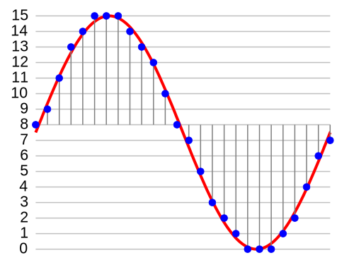

# Specification

## 4.5.6.1 Bit patterns, images, sound and other data
There are many ways in which bit patterns are used to store and represent other forms of data. One example of this is Pulse Code Modulation, a way of storing analogue sound waves as digital bit patterns.

These values sampled from the analogue wave would be stored as the binary representation of each value, e.g.

\`8\ 9\ 11\ 13\ 14\ 15\ 15\ 15 = 1000\ 1001\ 1011\ 1101\ 1110\ 1111\ 1111\ 1111\`