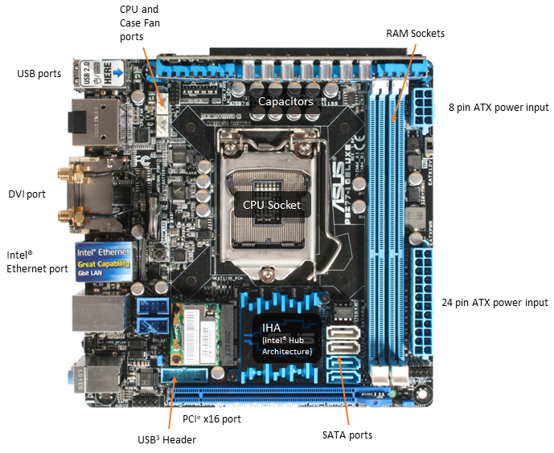
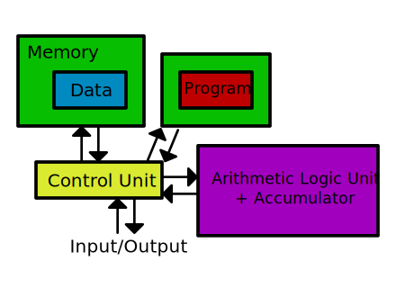
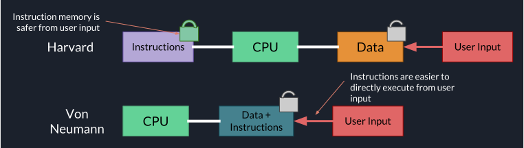

# Specification

## 4.7.1.1 Internal hardware components of a computer

### Basic internal computer components
There are many components that are used in a computer. Some of these include:

- RAM
- HDD
- SSD
- CPU (Processor)
- Sound card
- Motherboard
  - Northbridge
  - Southbridge
  - CMOS battery
  - ROM (Read Only Memory, stores the BIOS)
- Graphics card (GPU)
- Power supply
- Optical drive
- Fans
- Case
- Network card
- USB card

Many of these components have more recently integrated into others, as they do not need to be seperate components. Examples of this includes sound cards, network cards and USB cards being integrated into motherboards.

SOC (System On Chip) systems combine many components (e.g. networking, northbridge/southbridge, CPU, and GPU) into one single chip. This is useful for phones and embedded systems, as it reduces power consumption and cost of these systems.

#### Design your Dream Computer

Here is the list of items I would use in my Dream Computer.

[PCPartPicker part list](https://uk.pcpartpicker.com/list/pRtmYr) / [Price breakdown by merchant](https://uk.pcpartpicker.com/list/pRtmYr/by_merchant/)

Type|Item|Price|Rationale|Image
:----|:----|:----|:----|:----
**CPU** | [Intel - Core i7-7700K 4.2GHz Quad-Core Processor](https://uk.pcpartpicker.com/product/VKx9TW/intel-core-i7-7700k-42ghz-quad-core-processor-bx80677i77700k) | £265.60 @ Alza | I chose this as it is fast and has a high clock speed, and can be overclocked. This allows it to be efficient with my terrible single-threaded code. | 
**CPU Cooler** | [Corsair - H100i v2 70.7 CFM Liquid CPU Cooler](https://uk.pcpartpicker.com/product/CrDzK8/corsair-cpu-cooler-cw9060025ww) | £102.97 @ Amazon UK | I chose this as it cools the CPU sufficiently for overclocking, to improve performance of my code. | 
**Motherboard** | [MSI - Z270-A PRO ATX LGA1151 Motherboard](https://uk.pcpartpicker.com/product/KvvZxr/msi-z270-a-pro-atx-lga1151-motherboard-z270-a-pro) | £84.99 @ Amazon UK | I chose this as it has many settings allowing advanced overclocking of the CPU, and supports VT-x so I can emulate multiple operating systems. | 
**Memory** | [G.Skill - Trident Z RGB 64GB (4 x 16GB) DDR4-3200 Memory](https://uk.pcpartpicker.com/product/qzJkcf/gskill-trident-z-rgb-64gb-4-x-16gb-ddr4-3200-memory-f4-3200c14q-64gtzr) | £749.99 @ Overclockers.co.uk | I chose this RAM as it is just about large enough to reduce the amount of GC in my code. | 
**Storage** | [Intel - 540s 1TB M.2-2280 Solid State Drive](https://uk.pcpartpicker.com/product/KPX2FT/intel-540s-1tb-m2-2280-solid-state-drive-ssdsckkw010x6x1) | £335.99 @ Ebuyer | I chose this SSD as it is very fast, and uses M.2 so it is closer to the CPU and therefore reduces the error rate. It is also 1TB, allowing storage of many compiled node.js binaries. | 
**Video Card** | [Gigabyte - GeForce GTX 1080 8GB Xtreme Gaming Water cooling Video Card](https://uk.pcpartpicker.com/product/fvjWGX/gigabyte-geforce-gtx-1080-8gb-xtreme-gaming-water-cooling-video-card-gv-n1080xtreme-w-8gd) | £669.98 @ Novatech | I chose this graphics card as it has a high clock speed, so I can maximise the performance of my single-threaded code. | 
**Case** | [Corsair - 760T Black ATX Full Tower Case](https://uk.pcpartpicker.com/product/yLvRsY/corsair-case-760tblack) | £156.70 @ CCL Computers | I chose this case as it is large, and has good cooling for all my components. | 
**Power Supply** | [SeaSonic - PRIME Titanium 850W 80+ Titanium Certified Fully-Modular ATX Power Supply](https://uk.pcpartpicker.com/product/74M323/seasonic-prime-850w-80-titanium-certified-fully-modular-atx-power-supply-ssr-850td) | £229.99 @ Amazon UK | I chose this power supply as it is very efficient, making the world a better place. | 
**Monitor** | [Asus - PG279Q ROG Swift 27.0" 2560x1440 165Hz Monitor](https://uk.pcpartpicker.com/product/XvfmP6/asus-monitor-pg279q) | £660.14 @ BT Shop | I chose this monitor as it has a very high refresh rate, allowing instantaneous viewing of my terrible single-threaded interpreted code. | 
**Keyboard** | [Corsair - K55 RGB Wired Gaming Keyboard](https://uk.pcpartpicker.com/product/q7648d/corsair-k55-rgb-wired-gaming-keyboard-ch-9206015-na) | £78.67 @ Amazon UK | I chose this keyboard as it is mechanical, and has RGB allowing for 16.5 million customisation options. | 
**Mouse** | [Logitech - G500 Wired Laser Mouse](https://uk.pcpartpicker.com/product/3vJwrH/logitech-mouse-910001259) | £230.00 @ Amazon UK | I chose this mouse as it has several customisable buttons on it, to allow instant refactoring with a button press. | 
 | *Prices include shipping, taxes, rebates, and discounts* |
 | **Total** | **£3565.02**
 | Generated by [PCPartPicker](http://pcpartpicker.com) 2017-11-22 01:58 GMT+0000 |

#### Motherboard.pptx
This is a diagram of a motherboard, created using Microsoft PowerPoint and exported to an image for viewing here. This shows many of the components required to operate a computer.

### I/O controllers
The northbridge and southbridge are located on the motherboard, and allow the processor to communicate with peripherals and some components. They are used because the communication protocols between peripherals and the computer are very complex, and would significantly slow down processing if the processor had to wait for peripherals and components to respond every time it wanted to use them.

The southbridge handles communication with hard drives (e.g. SATA), audio, graphics processors, USB peripherals and Ethernet (networking). The northbridge handles communication with the RAM (main memory) and PCI (for add-in cards, such as graphics cards and sound cards).

### Communication between components
Buses are used to send data between components in a computer. They are required because there is not enough space on the motherboard to send data directly between each component. 

The address bus allows the processor to specify which memory location it wants to write to or read from. It is unidirectional, from the processor to the memory. This allows many different memory locations to be addressed and modified.

The data bus transfers the actual data that the processor is using. It is bidirectional, so it allows both reading and writing of data. For example, the byte that the processor wants to write is output on the data bus. The memory module then receives this byte and writes it to the physical memory.

The control bus coordinates the activities of the computer, and is unidirectional. It is controlled by the control unit (CU), and indicates what operation the processor wants to perform, e.g. read, write, erase.

### Von Neumann vs Harvard
The Von Neumann architecture is described in [The stored program concept](/docs/4/7/stored-program-concept/).

#### Issues with the Von Neumann architecture
There were several issues discovered with the Von Neumann architecture:

- **Shared memory** - Defective programs could overwrite other programs, causing crashes or data leakage
- **Memory leaks** - Failure to release memory back to the operating system after using it could cause there to be insufficient memory for other programs, causing crashes
- **Data Bus speed** - All of the information required for operation of the computer was transferred through one single data bus, which limits the performance of the CPU, causing a bottleneck as data cannot be accessed fast enough

#### The Harvard Architecture

The Harvard Architecture was invented to combat these problems. It gets around the bottleneck by having two data busses and memory storage locations, one for program storage and another for data storage. This does take up more physical space, but it significantly increases security and speed.

Due to this separation, the Harvard architecture is easier to secure, as data (such as keyboard input, save files) cannot be executed as instructions directly. This means that glitches and hacks are harder to execute, as they cannot be directly input, and must be copied to instruction memory first.

#### Uses of Von Neumann and Harvard
Because the Harvard architecture is more expensive, it is more commonly used in systems that require high security or fast speed. Embedded systems, such as Digital Signal Processing systems (DSP) use this architecture, as they require fast access to data. It is also used in microcontrollers, as they often require real-time operation.

The Von Neumann architecture is often used on general purpose computing systems, as it is significantly easier to use and cheaper. This is because you do not have to move data to a seperate storage chip just to add new programs to it. It also only requires one storage system, so it is significantly cheaper.

Many modern systems now use a hybrid of both architectures. They use the Harvard architecture for Level 1 and Level 2 cache, as it is faster, and use the Von Neumann architecture for Level 3 cache and storage, as it is cheaper.

### Addressable memory
Most computer systems use DRAM for main memory. This is connected as DIMM modules in DDR slots in the motherboard. This allows them to be easily replaced and upgraded. Compared to cache, they are relatively inexpensive and can store large amounts of data, and are much faster than hard drives. Because they are volatile (cleared when power is lost), they are used for temporarily storing data that the computer is currently using. However, they do require a refresh signal with a constant charge, so they use a lot of power.

This memory is addressed through the Operating System, which allocates it to programs. If the main memory is full, the Operating System creates a pagefile (virtual memory file, also known as swap) on the hard drive. It then "swaps" data between main memory and the hard drive, to ensure the most used data is in main memory.

DRAM|SRAM|ROM
---|---|---
Volatile|Volatile|Non-volatile
Used in DIMMs (RAM)|Used in cache|Used in the motherboard, to store BIOS
Quite cheap|Very expensive|Very cheap
Slow to access|Very fast to access|Slowest to access
Refresh signal required|No refresh signal required|No refresh signal required

Historically, ROM chips were read-only, and stored the BIOS. More recent ROM chips are reprogrammable (EEPROM/EPROM) and erasable, and also store extra settings about the system, such as the boot order.