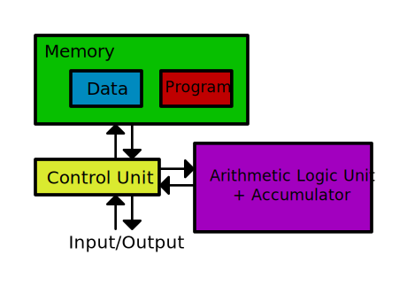

## Lesson Notes

Originally, computers were programmed for just one job at a time, and could not do jobs other than the one it was programmed with. Manual reprogramming for computers then was tedious, as each cable had to be manually rewired. ENIAC, one of the earliest general-purpose computers, took 3 weeks to rewire for a new tasks. 

# Specification

## 4.7.2.1 The meaning of the stored program concept
A solution was made to this problem, where the program is stored as well as data in memory, rather than just storing data in memory. This resulted in the Von Neumann architecture (stored program architecture).


The first computer to implement this architecture was SSEM (Small-Scale Experimental Machine), the first reprogrammable stored-program computer, designed by people at Manchester University in 1948. This enabled significantly faster development of programs for the computer, so better software could be developed.

In the stored program concept, there is a 3 box model:

<-----|Bus (connects all three)|----->
---|---|---
Processor|Storage|I/O
CPU|Main Memory|Communication with other devices

Storage forms consist of usually:

Cache|RAM|HDD/ODD/USB
---|---|---
Fast|->>|Slow
Small|->>|Large

The stages of Von Neumann execution, for a game, are as follows:

- Secondary storage is inserted (e.g. DVD)
- Data is loaded into main memory
- Instructions are fetched, decoded and executed by the CPU serially, so that each instruction is executed after previous instructions in the order they are stored

The Control Unit handles movement of instructions and data around the CPU. These instructions and data are carried on busses, sending information to different components of the CPU. The ALU (Arithmetic and Logic Unit) carries out calculations of the CPU.

There is also a variation of this model, called the Harvard architecture, which is discussed in section 4.7.1: [Internal hardware components of a computer](/docs/4/7/internalcomponents/).

### RISC and CISC
CISC (Complex Instruction Set Computing) is a method of executing instructions where one single instruction can execute several operations. For example, an increment instruction (INC) might:

- Load memory address 01 into accumulator
- Add 1 to accumulator
- Store accumulator into memory address 01

This allows complex instructions to be executed more efficiently, as they can be optimised to run using less clock cycles.

However, RISC (Reduced Instruction Set Computing) executes tasks in a manner such that processors only use simple instructions that can be executed with one clock cycle. For example, the operations that the increment instruction (in CISC) carries out would each be their own instruction, e.g. LDR, ADD, STR.

#### Benefits of RISC
- Despite the fact that the instructions are broken down into several parts compared with the MULT command used in CISC, the instructions run with a single clock cycle, therefore this means that it will take approximately the same amount of time to execute
- In addition to this, the RISC systems require less transistors and therefore less hardware space when compared with the complex instructions involved with CISC, leaving more room for general purpose registers, as all of the instructions execute at the same time in the same amount of time, making pipelining possible.
- Separating the commands reduces the amount of work that must be performed as after a MULT command is executed, the processor erases the registers, however if one of the operands needs to be used for another computation in a RISC processor, it can be kept, therefore improving efficiency of the system.
- Due to the simpler instruction set, RISC processor types can run at a lower clock speed but still beat CISC processors at simple tasks. Consequently, they also use less power and are cheaper to manufacture than CISC processors.

#### Disadvantages of RISC
- Despite the fact that there are many advantages to RISC instruction set, the chips took a long time to gain support due to the lack of software support for them.
- Despite the interest of many companies, few programs were designed with RISC in mind therefore many companies were not willing to take the chance with this technology in fear of limiting their product
- This lack of commercial interest meant that very few could be produced and they were not able to become competitive with the volumes of processors which they were able to produce
- The presence of companies like Intel caused a setback due to the fact that CISC chips were becoming increasingly unwieldy and difficult to develop, however Intel had the resources to continue production of powerful processors, and despite the fact that RISC chips might surpass Intel’s efforts in some areas, the differences were not great enough to persuade many buyers to change technologies
- Due to the simplicity of the instruction set, to perform complex tasks RISC processors must combine instructions rather than using a single complex instruction like CISC processors can. This reduces the performance of RISC processors at complex tasks.
